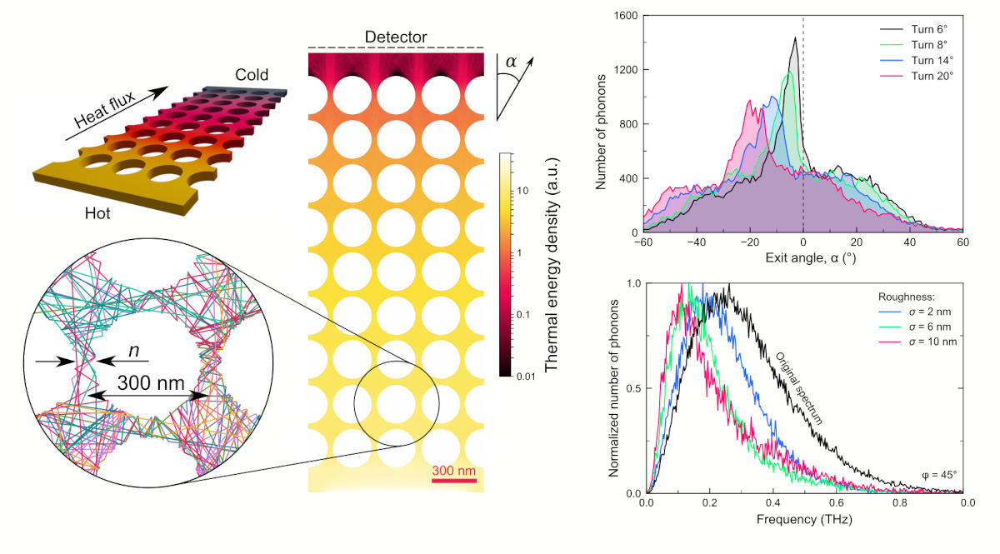

# FreePATHS

This Monte Carlo algorithm simulates trajectories of phonons in 3D models of nanostructures, which consists of a box with holes or pillars of various shapes. The algorithm outputs phonon trajectories, heat fluxes, temperature maps and profiles, the thermal conductivity, scattering maps and statistics and other information.

<figure><figcaption>
Examples of FreePATHS outputs
</figcaption></figure>

### Code repository

[https://github.com/anufrievroman/freepaths](https://github.com/anufrievroman/freepaths)

### Contents

* [Installation](getting-started/installation.md)
* [Usage](getting-started/usage.md)
* [Algorithm](algorithm.md)
* [Equations](equations.md)
* [References and credits](references-and-credits.md)
* [Tutorials](broken-reference/)
