# Creating new holes (the easy way)

This tutorial explains how you can crate new hole shapes using the very flexible `PointLineHole` and the even easier to use `FunctionLineHole`. There is an [alternative way](adding-your-own-hole-or-pillar-the-advanced-way.md) of creating new hole shapes through programming but this is a lot more difficult.

In simple words you can use the `PointLineHole` to draw any line you want which will then become a hole. It is quite easy to define these lines using mathematical functions or python functions. How to do this is explained below with more detail. As an example for a hole defined with a mathematical function here is a hole build using the function `sin(x)/x`.

<figure>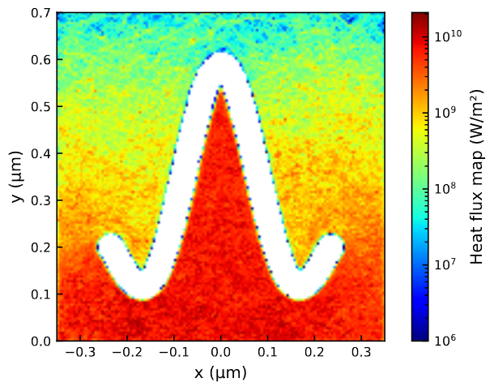<figcaption><p>Example hole in the shape of `sin(x)/x`.</p></figcaption></figure>

## How does the PointLineHole work behind the scenes

The `PointLineHole` creates many circular holes that are at closely spaced points along a line. If the circular holes are spaces closely enough this will give the impression of a continuous line with a certain thickness. If there are not enough circles or points the shape will become irregular and the scattering will be inconsistent as you can see in the below image. So always make sure that the holes are spaced closely enough. But if you generate too many points the execution time of the simulation might increase because the phonon position has to be checked against more points.

<figure>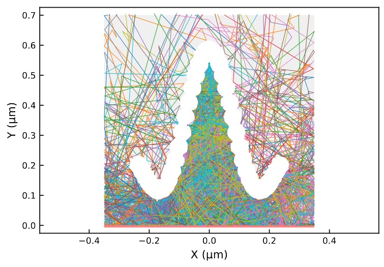<figcaption><p>Example of low number of circles.</p></figcaption></figure>

The `FunctionLineHole` is just a wrapper for `PointLineHole` where you provide a mathematical function that is used to generate the holes.

## How to use a mathematical function to define a hole

The `FunctionLineHole` uses a mathematical function to define the hole shape. Let's use `sin(x)/x` as an example. Here is how this is coded.

```python
HOLES = [FunctionLineHole(x=0, y=200e-9, function_range=(-2*np.pi, np.pi), function=lambda x: np.sin(x)/x, size_x=500e-9, size_y=300e-9, resolution=1e-9, thickness=30e-9, rotation=0)]
```

Let's go through the arguments one by one:
- With the `x` and `y` arguments can be used to position the hole in the structure. It is an offset between the origin of the simulation's coordinate system and the functions coordinate system. So if both are set to 0 the function will simply be drawn in the structure's coordinate system.
- The `function_range` argument defines from what x value to what x value the function is plotted. For `sin(x)/x` `-2pi` and `2pi` are good spots. You can see this example above. For demonstration purposes here i will use an range of `-2pi` and `pi`. Notice how with an asymmetric range the origin of the function and therefore the reference point for it's position is not at it's center.
- The simplest way of defining the `function` is using a lambda function. Lambda functions are very easy to use: Just write `lambda x: ` and put the expression to be evaluated behind this. It is also possible do simply define a regular function which we will come back to.
- You can use `size_x` and `size_y` to define the size of the resulting structure. This will take into account the thickness of the hole so that the total hole size corresponds to what was put in. We will also come back to this.
- The `resolution` is the distance in x between two adjacent points or circles. Pay attention that this is only the distance in x direction so if the function is steep the actual distance between the points will be significantly larger than this. 
- With `rotation` the function is rotated around it's origin by the number of degrees specified.

<figure>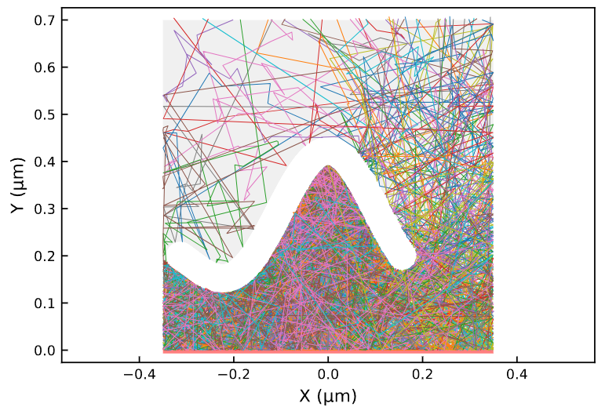<figcaption><p>Example with asymmetric range.</p></figcaption></figure>

### Addressing singularities

You probably noticed that `sin(x)/x` cannot be evaluated at `x=0` because of the division by x. Since only some points of the function are evaluated this can be fine but it can cause errors and should be addressed. A simple way to do this is by defining a python function like this:

```python
def sinxdivx(x):
    if x == 0:
        return 1
    else:
        return np.sin(x)/x

HOLES = [FunctionLineHole(x=0, y=200e-9, function_range=(-2*np.pi, np.pi), function=sinxdivx, size_x=500e-9, size_y=300e-9, resolution=1e-9, thickness=30e-9)]
```

As you can see any python object that takes one argument and outputs a number can be used here. Here is an alternative way of implementing this:

```python
sinxdivx = lambda x: 1 if x == 0 else np.sin(x)/x

HOLES = [FunctionLineHole(x=0, y=200e-9, function_range=(-2*np.pi, np.pi), function=sinxdivx, size_x=500e-9, size_y=300e-9, resolution=1e-9, thickness=30e-9)]
```

### Alternative sizing method

For more control over the sizing of the function you can set `size_x` and/or `size_y` to `None` (or omit them) and instead set the scaling through the function. Here is an example where the x scaling is controlled through the function:

```python
HOLES = [FunctionLineHole(x=0, y=200e-9, function_range=(-2*np.pi, np.pi), function=lambda x: np.sin(x)/x*300e-9, size_x=None, size_y=300e-9, resolution=1e-9, thickness=30e-9)]
```

And here an example where both are controlled through the function:

```python
HOLES = [FunctionLineHole(x=0, y=200e-9, function_range=(-500e-9*2/3, 500e-9/3), function=lambda x: np.sin(x*3*np.pi/500e-9)/(x*3*np.pi/500e-9)*300e-9, resolution=1e-9, thickness=30e-9)]
```

Take into consideration that the hole will be bigger than the function because of it's thickness.

## How to use PointLineHole

As mentioned `FunctionLineHole` is just a wrapper for `PointLineHole`. This means that we can implement our own function for generating the points. Here is a simple example where we simply provide two hard coded points:

```python
HOLES = [PointLineHole(x=0, y=200e-9, points=[(0,0), (25e-9, 150e-9)], thickness=30e-9, rotation=0)]
```

<figure>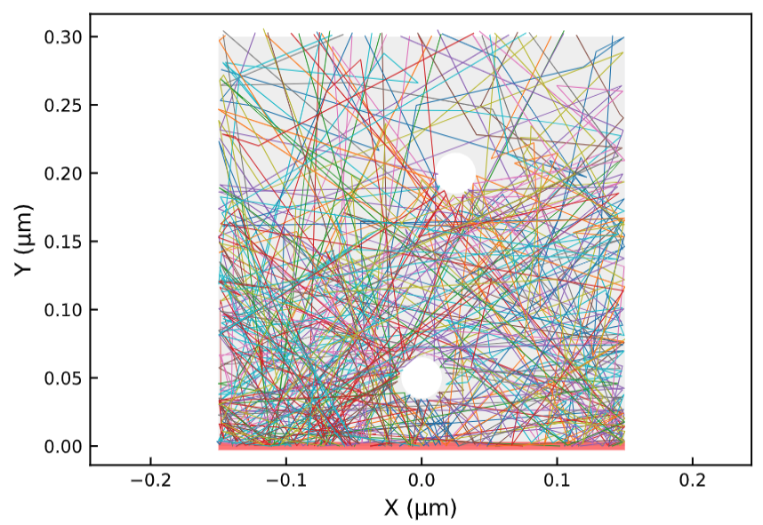<figcaption><p>Example with two points.</p></figcaption></figure>

This hole is best used with a python function to generate the list of points. Even with very basic programming knowledge this hole can be a very versatile and powerful tool. This will be demonstrated through some following examples. You can also have a look at how `FunctionLineHole` in the code as another example.

### Example 1 - Lines

As a first example i will demonstrate how you can draw straight lines using this hole:

```python
import numpy as np

def generate_points_on_line(dx, dy, resolution):
    number_of_points = round(np.sqrt(dx**2 + dy**2) / resolution)

    xs = np.linspace(-dx/2, dx/2, number_of_points)
    ys = np.linspace(-dy/2, dy/2, number_of_points)

    return np.vstack((xs, ys)).T

def make_line_hole(dx, dy, resolution, x, y, thickness, rotation):
    points = generate_points_on_line(dx, dy, resolution)
    return PointLineHole(x, y, points, thickness, rotation)

HOLES = [make_line_hole(100e-9, 150e-9, 5e-9, 0e-9, 150e-9, 30e-9, 0)]
```

<figure>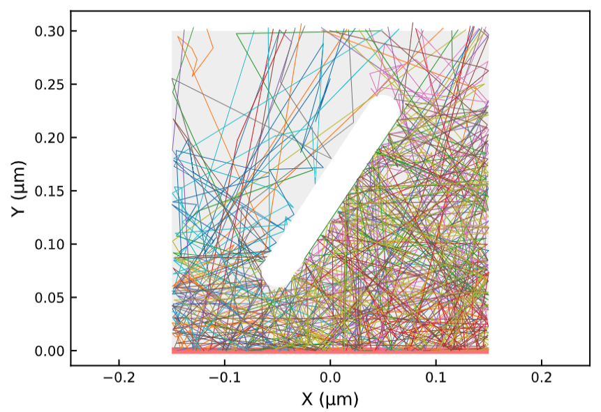<figcaption><p>Simple line.</p></figcaption></figure>

The size of the line in x and y are defined through `dx` and `dy`, `resolution` is used to define the distance between points, `x` and `y` position the center of the line. `thickness` and `rotation` work as expected. Now multiple lines can be used to generate more complex structures like letters:

```python
HOLES = [
    make_line_hole(0e-9, 150e-9, 5e-9, -40e-9, 150e-9, 30e-9, 0),
    make_line_hole(-80e-9, 150e-9, 5e-9, 0e-9, 150e-9, 30e-9, 0),
    make_line_hole(0e-9, 150e-9, 5e-9, 40e-9, 150e-9, 30e-9, 0),
    ]
```
<figure>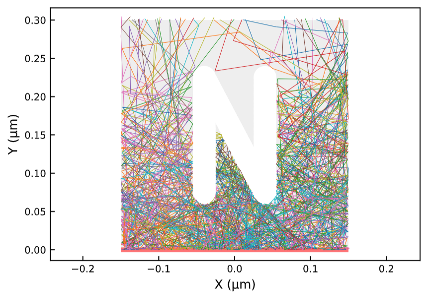<figcaption><p>Letter built out of simple lines.</p></figcaption></figure>

The problem is that if you try to rotate the structure using the `rotation` argument you rotate each line individually instead of the whole structure:

```python
HOLES = [
    make_line_hole(0e-9, 150e-9, 5e-9, -40e-9, 150e-9, 30e-9, 30),
    make_line_hole(-80e-9, 150e-9, 5e-9, 0e-9, 150e-9, 30e-9, 30),
    make_line_hole(0e-9, 150e-9, 5e-9, 40e-9, 150e-9, 30e-9, 30),
    ]
```

To prevent this it is better to make one big list with all the points like this:

```python
def make_line_structure(lines, resolution, x, y, thickness, rotation):
    points = []
    for dx, dy, x0, y0 in lines:
        points.extend(generate_points_on_line(dx, dy, resolution) + (x0, y0))
    return PointLineHole(x, y, points, thickness, rotation)

HOLES = [
    make_line_structure([
        (0e-9, 150e-9, -40e-9, 0e-9),
        (-80e-9, 150e-9, 0e-9, 0e-9),
        (0e-9, 150e-9, 40e-9, 0e-9),
        ], 5e-9, 0e-9, 150e-9, 30e-9, 30)
    ]
```

<div>
<figure>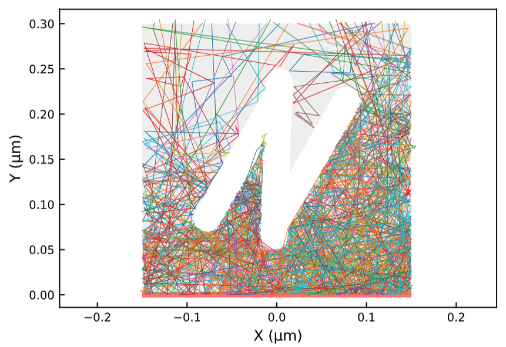<figcaption><p>Rotation applied to each line individually.</p></figcaption></figure>
<figure>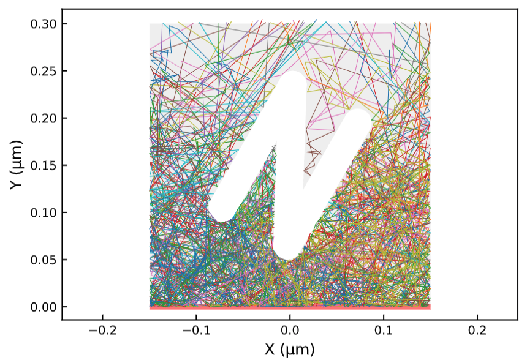<figcaption><p>Rotation applied to whole structure.</p></figcaption></figure>
</div>

### Example 2 - Circular arcs

Here is an example that generates circular arcs:

```python
def points_on_arc(radius, start_angle, end_angle, resolution):
    # Convert angles to radians
    start_angle_rad = math.radians(start_angle)
    end_angle_rad = math.radians(end_angle)

    # Calculate the number of points
    num_points = int(radius* abs(end_angle_rad - start_angle_rad) / resolution) + 1

    # Calculate angular increment
    angle_increment = (end_angle_rad - start_angle_rad) / (num_points - 1)

    # Generate points on the arc
    arc_points = []
    for i in range(num_points):
        angle = start_angle_rad + i * angle_increment
        x = radius * math.sin(angle)
        y = radius * math.cos(angle)
        arc_points.append((x, y))

    return arc_points

def make_arc_hole(radius, start_angle, end_angle, resolution, x, y, thickness, rotation):
    points = points_on_arc(radius, start_angle, end_angle, resolution)
    return PointLineHole(x, y, points, thickness, rotation)

HOLES = [make_arc_hole(200e-9, 20, 90, 5e-9, -100e-9, 50e-9, 30e-9, 0)]
```

<figure>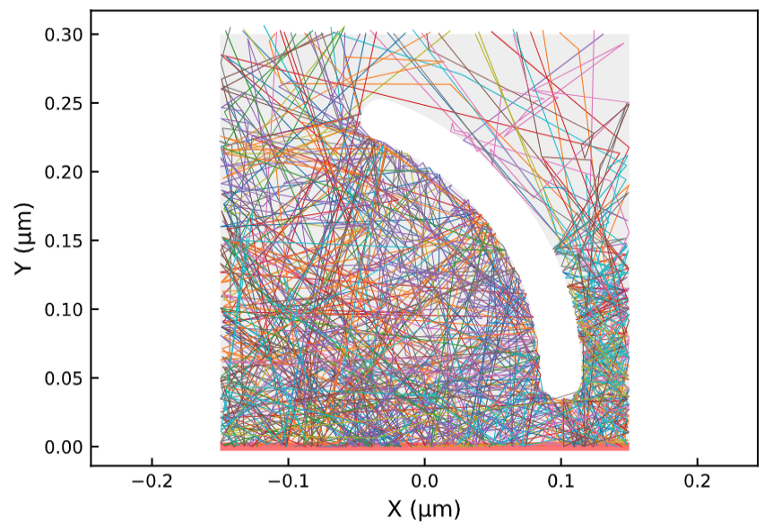<figcaption><p>Circular arc.</p></figcaption></figure>

### Example 3 - Combining structures

Here is how multiple generation functions can be combined to create even more complete shapes:

```python
def make_line_arc_structure(lines, arcs, resolution, x, y, thickness, rotation):
    points = []
    for dx, dy, x0, y0 in lines:
        points.extend(generate_points_on_line(dx, dy, resolution) + (x0, y0))
    for radius, start_angle, end_angle, x0, y0 in arcs:
        points.extend(np.array(points_on_arc(radius, start_angle, end_angle, resolution)) + (x0, y0))
    return PointLineHole(x, y, points, thickness, rotation)

HOLES = [
    make_line_arc_structure([
        (0e-9, 150e-9, -195e-9-40e-9, 0e-9),
        (-80e-9, 150e-9, -195e-9, 0e-9),
        (0e-9, 150e-9, -195e-9+40e-9, 0e-9),

        (0e-9, 150e-9, -65e-9-40e-9, 0e-9),
        (80e-9, 0e-9, -65e-9, -75e-9),

        (40e-9, 150e-9, 65e-9-20e-9, 0e-9),
        (-40e-9, 150e-9, 65e-9+20e-9, 0e-9),
        (40e-9, 0e-9, 65e-9, -35e-9),

        (0e-9, 150e-9, 195e-9-40e-9, 0e-9),
        (40e-9, 0e-9, 195e-9-20e-9, 75e-9),
        (40e-9, 0e-9, 195e-9-20e-9, 0e-9),
        (40e-9, 0e-9, 195e-9-20e-9, -75e-9),
        ], [
        (37.5e-9, 0, 180, 195e-9, -37.5e-9),
        (37.5e-9, 0, 180, 195e-9, 37.5e-9),
        ], 
        5e-9, 0e-9, 150e-9, 30e-9, 0)
    ]
```

<figure>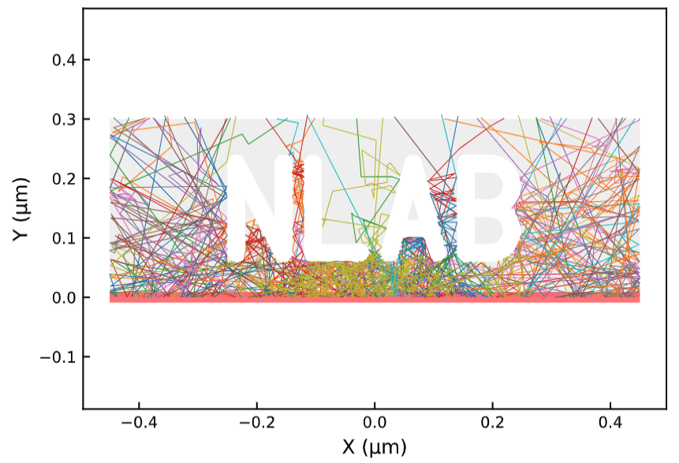<figcaption><p>Word built with lines and arcs.</p></figcaption></figure>

### Example 4 - Box with rounded corners

This hole can also be used to trace the outline of a shape which will result in an shape with rounded corners:

```python
def make_rounded_rectangle(x, y, size_x, size_y, resolution, thickness, rotation):
    return make_line_structure([
        (size_x, 0, 0, -size_y/2),
        (size_x, 0, 0, size_y/2),
        (0, size_y, -size_x/2, 0),
        (0, size_y, size_x/2, 0),
        ], resolution, x, y, thickness, rotation)

HOLES = [
    make_rounded_rectangle(0, 150e-9, 150e-9, 100e-9, 5e-9, 50e-9, 0),
    ]
```

If the shape is to big the hole can end up with an "island" in the middle. For the scattering behavior this is not a problem but the thermal conductivity calculation considers the structures volume so it is recommended to fill the middle in like this for example:

```python
def make_rounded_rectangle(x, y, size_x, size_y, resolution, thickness, rotation):
    return make_line_structure([
        (size_x, 0, 0, -size_y/2),
        (size_x, 0, 0, size_y/2),
        (0, size_y, -size_x/2, 0),
        (0, size_y, size_x/2, 0),
        ], resolution, x, y, thickness, rotation)

HOLES = [
    make_rounded_rectangle(0, 150e-9, 150e-9, 100e-9, 5e-9, 50e-9, 0),
    RectangularHole(0, 150e-9, 150e-9, 100e-9),
    ]
```

<div>
<figure>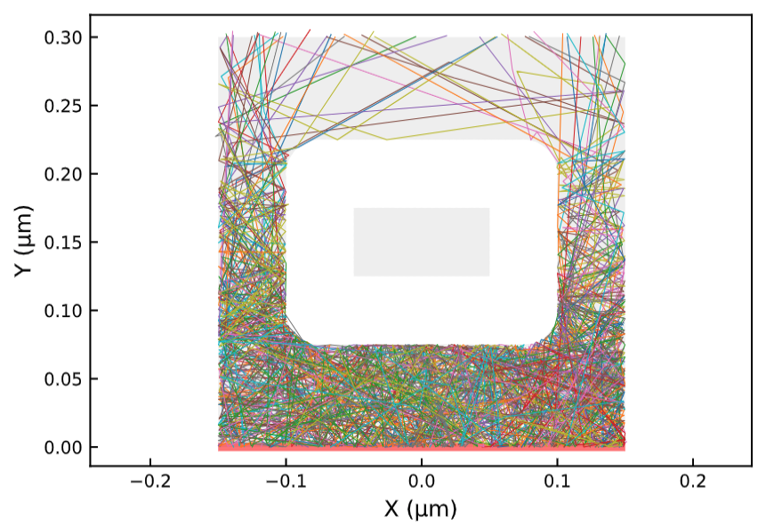<figcaption><p>Rounded rectangle.</p></figcaption></figure>
<figure>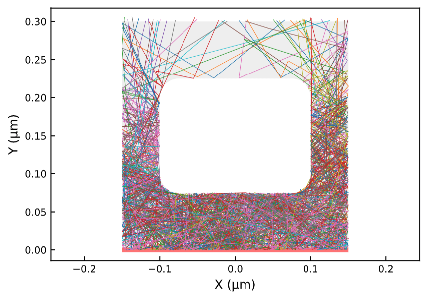<figcaption><p>Rounded rectangle with filled center.</p></figcaption></figure>
</div>

### Example 5 - Bezier curves

As a final example here is how to draw bezier curves:

```python
def points_on_bezier(control_point1, handle1, control_point2, handle2, number_of_points):
    # get coordinate points
    x1, y1 = control_point1
    x2 = x1 + handle1[0] 
    y2 = y1 + handle1[1]
    x4, y4 = control_point2
    x3 = x4 + handle2[0] 
    y3 = y4 + handle2[1]
    # define function
    bezier_function = lambda t, p1, p2, p3, p4: (1-t)**3*p1 + 3*t*(1-t)**2*p2 + 3*t**2*(1-t)*p3 + t**3*p4
    bezier_point_function = lambda t: (bezier_function(t, x1, x2, x3, x4), bezier_function(t, y1, y2, y3, y4))

    # calculate points and return
    return [bezier_point_function(t) for t in np.linspace(0, 1, number_of_points)]

points = points_on_bezier((-100e-9, 0), (50e-9, 100e-9), (100e-9, 0), (-50e-9, -100e-9), 100)
HOLES = [PointLineHole(0, 150e-9, points, thickness=30e-9)]
```

<figure>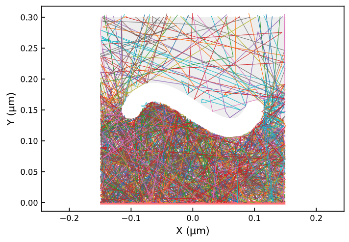<figcaption><p>Simple bezier curve hole.</p></figcaption></figure>
