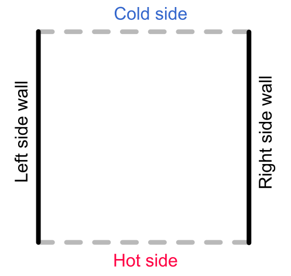
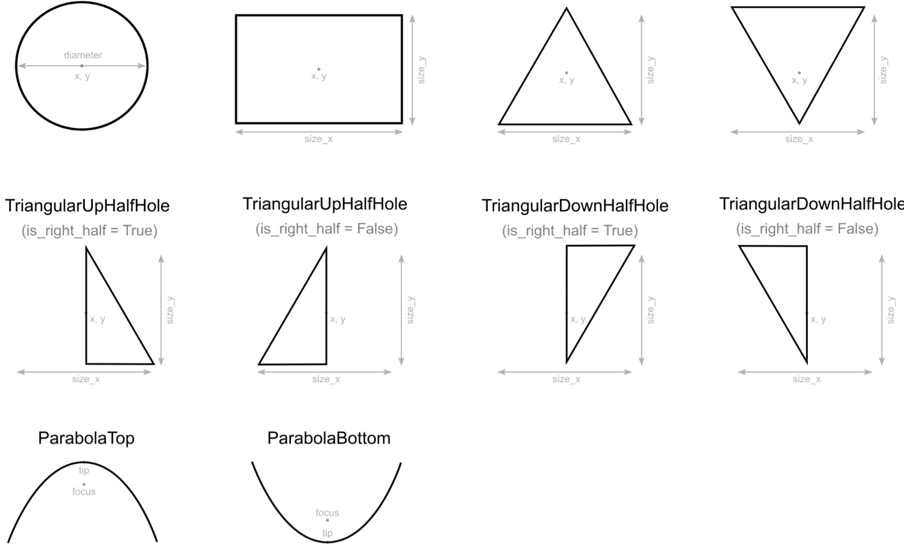

# Basics

### Examples and defaults

In the [examples](https://github.com/anufrievroman/freepaths/tree/master/examples) folder, you'll find several typical input files. Also, in the file [default\_config.py](https://github.com/anufrievroman/freepaths/blob/master/freepaths/default\_config.py), you'll find all possible config values that can be used in the input file. If some parameters are not provided, they'll be taken from the [default config](https://github.com/anufrievroman/freepaths/blob/master/freepaths/default\_config.py). If you input a non-existent parameter, it will be ignored and no error will be raised, so double-check the parameters. Some of the basic parameters are illustrated below:

<figure><figcaption><p>Scheme of simulated structure indicating several of the basic parameters.</p></figcaption></figure>

To begin, you can start with a simple set of most basic parameters, for example:

```
OUTPUT_FOLDER_NAME             = "Simple example"
NUMBER_OF_PHONONS              = 500
NUMBER_OF_TIMESTEPS            = 60000
TIMESTEP                       = 2e-12
T                              = 4
THICKNESS                      = 150e-9
WIDTH                          = 500e-9
LENGTH                         = 2200e-9
```

The output will be given in `Results/Simple example` folder.

### Walls and boundaries

The simulation domain consists of a box with dimensions `THICKNESS` × `WIDTH` × `LENGTH`. The floor and ceiling of the box are always physical walls. The sidewalls of this box can be set to be either hot side, cold side, or just a wall. By default, the bottom is assumed to be hot, the top is assumed cold, and the left and right walls are just physical walls. Basically, hot side means that phonons will be re-emitted from this wall if they hit it, while cold side will absorb the phonon.&#x20;

<figure><figcaption><p>Top view of a default simulation domain.</p></figcaption></figure>

Here are the default settings:

```
# Walls:
INCLUDE_RIGHT_SIDEWALL           = True
INCLUDE_LEFT_SIDEWALL            = True
INCLUDE_TOP_SIDEWALL             = False
INCLUDE_BOTTOM_SIDEWALL          = False

# Cold sides:
COLD_SIDE_POSITION_TOP           = True
COLD_SIDE_POSITION_BOTTOM        = False
COLD_SIDE_POSITION_RIGHT         = False
COLD_SIDE_POSITION_LEFT          = False

# Hot sides:
HOT_SIDE_POSITION_TOP            = False
HOT_SIDE_POSITION_BOTTOM         = True
HOT_SIDE_POSITION_RIGHT          = False
HOT_SIDE_POSITION_LEFT           = False
```

### Phonon sources

A source of phonons is an area where phonons are generated in a given direction. This area can be placed anywhere in the structure. Phonon source object has the following parameters, with zeroes as default values:

```
Source(x, y, z, size_x, size_y, size_z, angle_distribution)
```

By default, the area is simply reduced to a horizontal line and placed at the bottom side. This simulates emission of phonons by the hot side (which is also assigned to the bottom). Thus, by default, the `PHONON_SOURCES` list consists of only one object:

```
PHONON_SOURCES = [Source(
                x=0,
                y=0,
                z=0,
                size_x=WIDTH,
                size_y=0,
                size_z=THICKNESS,
                angle_distribution="random_up")]
```

Note that `angle_distribution` is set as `"random_up"`, this is necessary to prevent phonons generating outside the structure. The available angle distributions are:

<figure><figcaption><p>Available phonon angle distributions at the phonon source.</p></figcaption></figure>

The array `PHONON_SOURCES` can contain several sources. Then, phonons will be emitted from those source with equal probability. For example:

```
PHONON_SOURCES = [
                Source(x=-300e-9, size_x=100e-9),
                Source(x=0, size_x=100e-9),
                Source(x=300e-9, size_x=100e-9)
                ]
```

### Positioning holes and pillars

To place holes or pillars in the structure, the user needs to fill `HOLES` or `PILLARS` list with hole and pillar objects. For [example](phononic-crystal.md), the following code will create a 5x6 square lattice of circular holes:

```
HOLES = []
period = 300e-9
for row in range(5):
    for column in range(6):
        x = - 4 * period / 2 + column * period
        y = (row + 1) * period
        HOLES.append(CircularHole(x=x, y=y, diameter=200e-9))
```

### Hole shapes

The holes can be of different shapes e.g. circular, rectangular or triangular. One structure can contain holes of different shapes, thus one can simulate complicated geometries. The holes can overlap. The shapes of holes are determined by the objects in the  `HOLES` list, Pillars, however, for now can only be circular, so they do not require any `PILLAR_SHAPES` array. The scheme below illustrates possible hole shapes and corresponding parameters:

<figure><figcaption><p>Possible shapes of holes and walls with their respective parameters.</p></figcaption></figure>

However, pillars can only be circular, and created as:

```
PILLARS = []
PILLARS.append(CircularPillar(x=100e-9, y=200e-9, diameter=200e-9, height=200e-9))
```

See the [examples](https://github.com/anufrievroman/freepaths/tree/master/examples) folder for more concrete examples of hole array creation.

### Multiprocessing

You increase the speed of your simulations by using multiprocessing. Simply add desired number of processes to your input file. For example:

```
NUMBER_OF_PROCESSES = 8
```

By default, the simulations run on one process, but it can use as many processes as your computer has. In case of errors related to the multiprocessing, try to reduce the number of processes, or return to default value of one.
