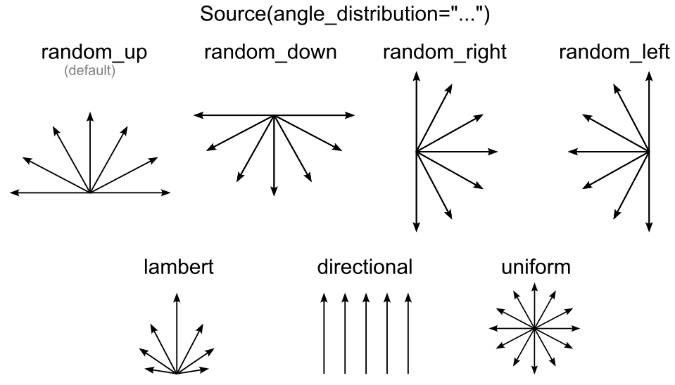

# Thermal gradients

Examples of systems with thermal gradient in different directions are provided in example files `anisotropy_study_horizontal.py` and `anisotropy_study_horizontal.py`

To create the vertical thermal gradient (which is the default case), the input file should include the following settings (they are set by default):

```
# Walls:
INCLUDE_RIGHT_SIDEWALL         = True
INCLUDE_LEFT_SIDEWALL          = True
INCLUDE_TOP_SIDEWALL           = False
INCLUDE_BOTTOM_SIDEWALL        = False

# Hot and cold sides [m]:
COLD_SIDE_POSITION_RIGHT       = False
COLD_SIDE_POSITION_TOP         = True
HOT_SIDE_POSITION_LEFT         = False
HOT_SIDE_POSITION_BOTTOM       = True

# Phonon source:
PHONON_SOURCES = [Source(x=0, y=0, z=0, size_x=WIDTH,  size_y=0, size_z=THICKNESS, angle_distribution="random_up")]
```

Note that only left and right side walls exist in the system and distribution of angles at the phonon source is set to `random_up`, which mean a random distribution of angles from -90 to +90 degrees. Make sure that the chosen angle distribution corresponds to the chosen position of hot side, so that it does not emit phonon outside the system. All available distributions are illustrated below:

<figure><figcaption><p>Available phonon angle distributions at the phonon source.</p></figcaption></figure>

Thus, to create the horizontal thermal gradient, side walls should be rearranged, distribution changed and cold/hot side positions changed accordingly. For example, as follows:

```
# Walls:
INCLUDE_RIGHT_SIDEWALL         = False
INCLUDE_LEFT_SIDEWALL          = False
INCLUDE_TOP_SIDEWALL           = True
INCLUDE_BOTTOM_SIDEWALL        = True

# Hot and cold sides [m]:
COLD_SIDE_POSITION_TOP         = False
COLD_SIDE_POSITION_RIGHT       = True
HOT_SIDE_POSITION_LEFT         = True
HOT_SIDE_POSITION_BOTTOM       = False

# Phonon source:
PHONON_SOURCES = [Source(x=-WIDTH/2, y=LENGTH/2, z=0, size_x=0,  size_y=LENGTH, size_z=THICKNESS, angle_distribution="random_right")]
```

Below are the schemes of these two systems and resulting thermal gradients:

<figure><figcaption><p>Schemes and gradients in systems with vertical and horizontal gradients.</p></figcaption></figure>

Likewise, the gradient can be set in any other direction as long as hot and cold sides are different. More than one wall can serve as a cold or a hot side. Essentially, hot side means that phonons will be diffusely scattered from that wall (thermalized). Conversely, cold side means that phonons will be absorbed by that wall and simulation will be over for these phonons.

Note that while it is possible to send the phonons through the structure in any direction the thermal conductivity calculation will only work for phonons traveling in the y direction.
